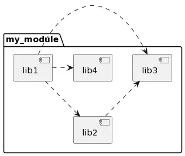

# py_coupling_metrics

Misc. [software package metrics](https://en.wikipedia.org/wiki/Software_package_metrics) for python:

* (Ca) Afferent coupling -> _number of modules/packages that depend on a module/package_
* (Ce) Efferent coupling -> _number of modules/packages that are dependencies of a module/package_
* Instability -> _Ce/(Ce+Ca)_
* Abstractness -> _ratio of abstract classes in a module/package_
* Distance to main sequence -> _distance of module/package to the line A + I = 1_

It also generates a [PlantUML](https://plantuml.com/) diagram of the analyzed project!
You can easily visualize this diagram e.g. on [https://www.planttext.com/](https://www.planttext.com/)

Example usage:

```
python3 -m coupling_metrics --project_root tests/example_project --package_name my_module
```

This will produce a report with metrics like:

```
------------------
Distance to main sequence:
------------------
my_module.lib3 -> 1.0
my_module.lib4 -> 0.6666666666666667
my_module.lib2 -> 0.5
my_module.lib1 -> 0.0
 -> average: 0.54
```

And a PlantUML diagram like:



Note that in order to implement these metrics, which are mostly related to
object-oriented programming, I have assumed that every python module file
is a class by itself.
Abstractness is calculated as `abstract/(concrete + abstract)` where
`abstract` is the amount of classes that have at least one explicit
`@abstractmethod` decorator, and `concrete` is the amount of concrete
methods defined in the module, or classes that do not have abstract methods.
So in order for one module to count as 100% abstract, it does not have to
declare extra methods outside the scope of the abstract classes defined in it.

Some features that are still not implemented:
* Allow analyzing references to packages outside of the considered namespace,
with configurable levels for each such external package.
* Draw a diagram of the position of each analyzed module in the main sequence line.

## Coupling analysis

See this [nice blog post](https://www.entrofi.net/coupling-metrics-afferent-and-efferent-coupling) for context.
 This tool will print warnings whenever the instability of a dependency is bigger than that of its dependant.